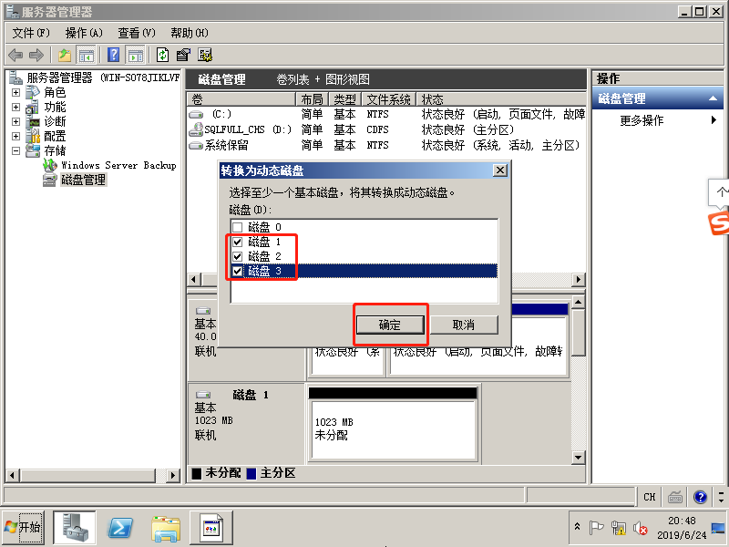
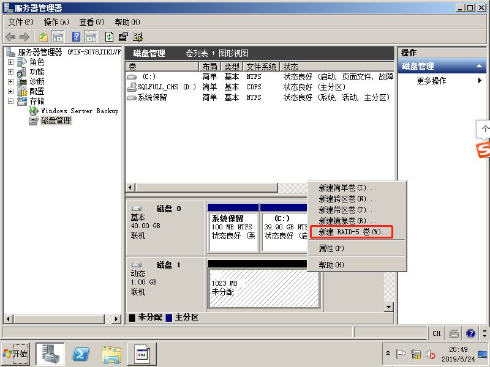
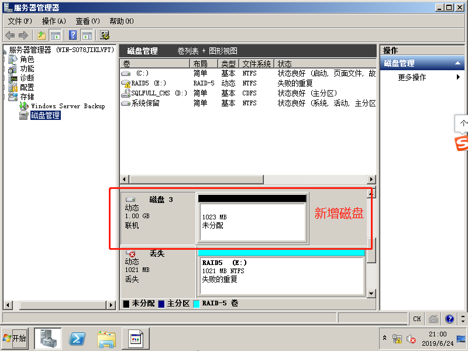

# WindowServer2008建立软RAID 5实验

## 建立 RAID5

1. 虚拟机已经安装好WindowServer2008，虚拟机设置添加至少3个磁盘（因为RAID5至少需要3个磁盘）。

    

2. 将磁盘设为联机并进行初始化（选择MBR与其他磁盘一致），再转化为动态磁盘。

    

  

3. 新建RAID-5卷。

    
    
    
    
    

4. 新建测试文件。
	
	
	

## RADI5的丢失与修复

1. 关闭虚拟机，移除一个磁盘，并添加一个新的磁盘作为修复的磁盘。启动虚拟机，并初始化这个磁盘。

    

2. 发现移除的磁盘当然丢失了，并且RAID5已被损坏。但是保存的文件依然完好无损。
	
	
	
	
	
	
	
3. RAID5的修复：点击修复卷，选择新增的磁盘，进行修复。
	
	
	
	
	
	
	

